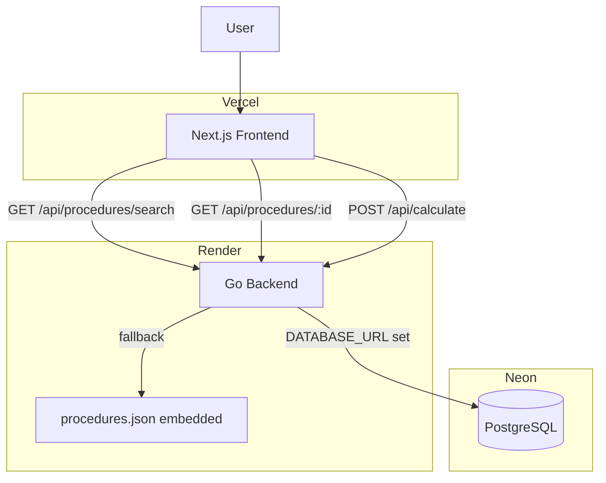

# Afere Architecture

## Overview

Afere is a deterministic medical procedure pricing platform built around the correct **SBN 1:N CBHPM** domain model. One SBN surgical package maps to multiple CBHPM billable codes. Physicians select which codes were performed, declare the access route type, and receive a real-time breakdown applying validated CBHPM 2022 billing rules.

See [domain-model.md](domain-model.md) for the full domain concepts, ER diagram, and calculation rules.

The system is composed of:

- Next.js frontend (Vercel)
- Go backend (Render)
- Embedded procedure catalog (procedures.json, fallback)
- PostgreSQL via Neon (production data layer)

## High-Level Architecture



## Components

### Frontend

Responsibilities:

- Search SBN procedures (debounced, accent-insensitive)
- Display all associated CBHPM codes with checkboxes; porte is read-only (intrinsic to the code)
- Access route selection (same vs different — drives CBHPM 4.1/4.2 discount)
- Auxiliary count selector (0–4) and anesthesia toggle
- Real-time valuation as composition changes (debounced 150 ms)
- Detailed breakdown: principal procedure, discount rule, per-auxiliary fees (CBHPM 5.1: 60/40/30/30%)
- Share a calculation via URL (includes route param)
- Render a shared calculation from URL params

### Backend

Responsibilities:

- Search SBN procedures (text + code + description match)
- Return procedure detail with all mapped CBHPM codes
- Execute multi-code billing calculations (pure functions, no I/O)
- Environment-aware: Neon if `DATABASE_URL` is set, embedded JSON otherwise

### Data Layer

Responsibilities:

- Store the SBN → CBHPM 1:N mapping catalog (Neon/PostgreSQL)
- Provide fallback catalog via embedded `procedures.json`
- Store porte values (seeded via migration 002)

## Backend Package Layout

```
backend/
  cmd/api/main.go          entry point; env-aware repo selection
  internal/
    config/                reads DATABASE_URL + PORT env vars
    models/                domain types
    repository/            interface + file + postgres implementations
    service/               pure calculation functions
    handlers/              HTTP handlers + routes
    generated/             openapi.gen.go (hand-maintained, matches openapi.yaml)
  db/
    migrations/            001_schema, 002_seed_portes, 003_seed_procedures, …
    query.sql              canonical SQL for PostgresRepository
```

## Valuation Engine

The calculation service (`internal/service/calculator.go`) is a pure function with no I/O. It implements:

### Principal procedure selection

The code with the highest monetary porte value is designated the principal.

### Multi-procedure discounting (CBHPM 2022, items 4.1 / 4.2)

| Access route | Formula |
|---|---|
| `same` (4.1) | `principal_value + 0.50 × Σ(additional values)` |
| `different` (4.2) | `principal_value + 0.70 × Σ(additional values)` |
| Single code | `100% of porte value` (no discount) |

### Auxiliary surgeon fees (CBHPM 2022, items 5.1 / 5.2)

Applied to the final surgeon value (after discounting), not to `total_base`.

| Position | Rate |
|---|---|
| 1st auxiliary | 60% |
| 2nd auxiliary | 40% |
| 3rd auxiliary | 30% |
| 4th auxiliary | 30% |

### API contract (openapi.yaml v3.0.0)

`POST /api/calculate` now requires `access_route_type: "same" | "different"` and returns:
- `surgeon_breakdown` — step-by-step derivation
- `individual_auxiliary_fees` — per-position fee with percentage
- `code_breakdown[].is_principal` — flags the principal code